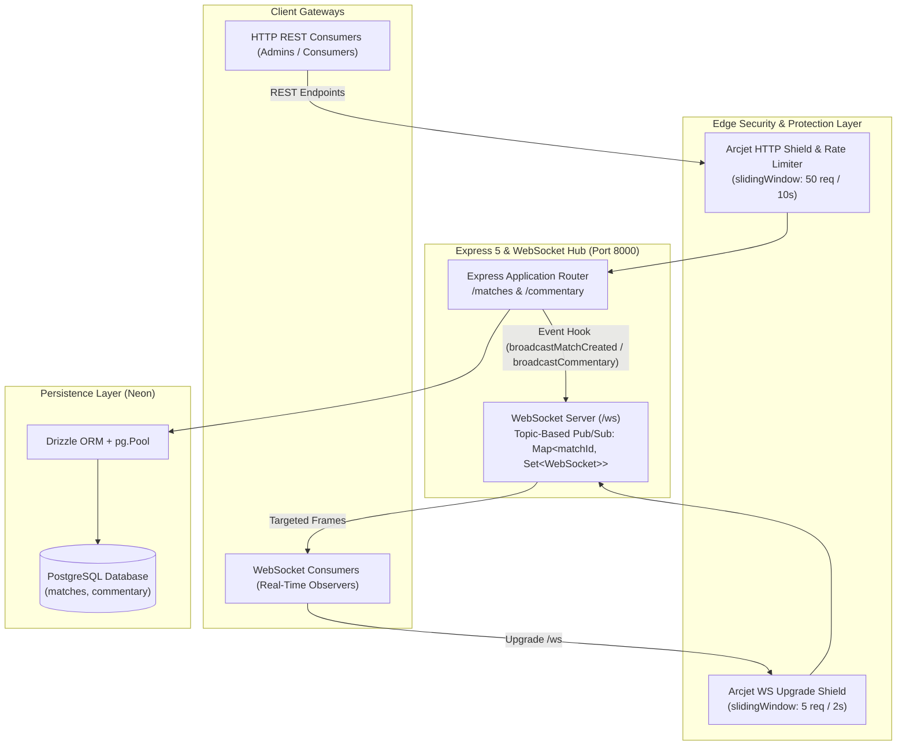
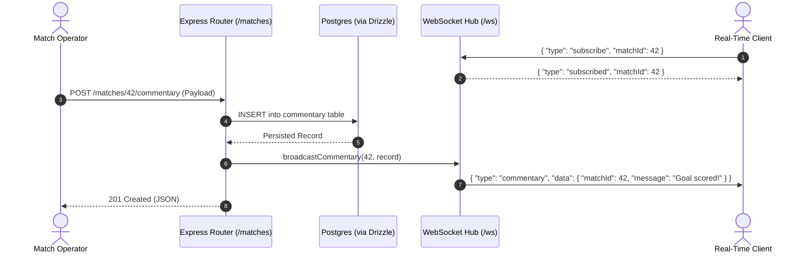

# Sportz: Real-Time Sports Tracking & Commentary Backend

[](https://nodejs.org/)
[](https://expressjs.com/)
[](https://orm.drizzle.team/)
[](https://neon.tech/)
[](https://arcjet.com/)
[](https://github.com/websockets/ws)
[](https://zod.dev/)
[](https://opensource.org/licenses/ISC)

A high-performance, real-time sports event tracking and live commentary broadcast engine. Built with an **Express 5** RESTful API, **WebSockets (`ws`)** topic-based pub/sub multiplexer, **Drizzle ORM** on **PostgreSQL (Neon)**, and edge security provided by **Arcjet**.

---

## Table of Contents

- [System Architecture](#system-architecture)
- [Core Capabilities](#core-capabilities)
- [Technology Stack](#technology-stack)
- [Project Structure](#project-structure)
- [Environment Configuration](#environment-configuration)
- [Quick Start & Migrations](#quick-start--migrations)
- [REST API Reference](#rest-api-reference)
- [WebSocket Protocol Reference](#websocket-protocol-reference)
- [Edge Security & Rate Limiting (Arcjet)](#edge-security--rate-limiting-arcjet)
- [500+ Concurrent User Scalability Guardrails](#500-concurrent-user-scalability-guardrails)
- [Verification & Smoke Testing](#verification--smoke-testing)
- [License](#license)

---

## System Architecture



### Event-Driven Broadcast Flow



---

## Core Capabilities

- **Topic-Based Channel Subscriptions**: Clients subscribe to discrete match feeds (`matchId`). Messages are routed exclusively to active subscribers rather than broadcast indiscriminately.
- **Global Broadcast Events**: Match creation updates are broadcast instantly across all open connections to keep ticker feeds synchronized.
- **Strongly Typed Persistence**: Powered by [Drizzle ORM](https://orm.drizzle.team/) with PostgreSQL schemas, custom enums (`match_status`: `scheduled`, `live`, `finished`), and JSONB metadata support.
- **Dynamic Match Status Resolution**: Match status is calculated based on start/end timestamps via [`src/utils/match-status.js`](file:///n:/Projects/Showcase/sportz/src/utils/match-status.js).
- **Automated Validation**: Strict schema validation on parameters, query strings, and payloads via [Zod](https://zod.dev/).
- **Multi-Vector Bot & DDoS Protection**: Arcjet protects HTTP endpoints and blocks abusive WebSocket handshake spam with sliding-window limits.

---

## Technology Stack

| Layer | Technology | Details |
|---|---|---|
| **Runtime & Framework** | [Node.js](https://nodejs.org/) & [Express 5](https://expressjs.com/) | Native ES Modules, Promise-based routing, merged route parameters. |
| **Real-Time Gateway** | [ws](https://github.com/websockets/ws) | Fast, lightweight WebSocket server initialized via [`attachWebSocketServer`](file:///n:/Projects/Showcase/sportz/src/ws/server.js#L82). |
| **Database & ORM** | [PostgreSQL (Neon)](https://neon.tech/) & [Drizzle ORM](https://orm.drizzle.team/) | Connection pooling with [`pg.Pool`](file:///n:/Projects/Showcase/sportz/src/db/db.js#L9), zero-overhead SQL querying. |
| **Security & Rate Limiting** | [@arcjet/node](https://arcjet.com/) | Bot detection, attack shield, and sliding-window rate limiters in [`arcjet.js`](file:///n:/Projects/Showcase/sportz/src/arcjet.js). |
| **Validation Engine** | [Zod](https://zod.dev/) | Strict input validation for query params, URL IDs, and request payloads. |

---

## Project Structure

```text
sportz/
├── src/
│   ├── index.js                  # Application entry point, HTTP & WS bootstrap
│   ├── arcjet.js                 # Arcjet security rules, rate limits & middleware
│   ├── crud.js                   # Demonstration script for database operations
│   ├── db/
│   │   ├── db.js                 # PostgreSQL pool initialization & Drizzle instance
│   │   └── schema.js             # Tables: matches and commentary + enums
│   ├── routes/
│   │   ├── matches.js            # GET & POST /matches
│   │   └── commentary.js         # GET & POST /matches/:id/commentary
│   ├── utils/
│   │   └── match-status.js       # Match status calculation logic
│   ├── validation/
│   │   ├── matches.js            # Zod validation schemas for matches
│   │   └── commentary.js         # Zod validation schemas for commentary
│   └── ws/
│       └── server.js             # WebSocket server, topic pub/sub & heartbeat
├── drizzle/                      # Generated SQL migration files
├── drizzle.config.js             # Drizzle Kit migration configuration
├── package.json                  # Scripts and dependencies
├── .env.example                  # Environment blueprint
└── README.md                     # Backend system documentation
```

---

## Environment Configuration

Copy the example file to configure your local environment:

```bash
cp .env.example .env
```

Define the following environment variables in `.env`:

```env
# PostgreSQL connection string from Neon Console:
DATABASE_URL="postgresql://[user]:[password]@[neon_hostname]/[dbname]?sslmode=require&channel_binding=require"

# Arcjet API Key for bot protection and rate limiting
ARCJET_KEY="ajkey_your_arcjet_api_key"

# Arcjet Execution Mode: 'LIVE' or 'DRY_RUN'
ARCJET_MODE="LIVE"

# Optional server bindings (defaults: 0.0.0.0:8000)
PORT=8000
HOST="0.0.0.0"
```

---

## Quick Start & Migrations

### 1. Install Dependencies

```bash
cd n:/Projects/Showcase/sportz
npm install
```

### 2. Run Database Migrations

Generate SQL schema definitions and apply them to your PostgreSQL database:

```bash
# Generate migration files from src/db/schema.js
npm run db:generate

# Execute migrations against PostgreSQL
npm run db:migrate
```

*(Optional) Launch Drizzle Studio to view database tables in your browser:*

```bash
npm run db:studio
```

### 3. Launch Development Server

```bash
npm run dev
```

Output:
```text
Server is running on http://localhost:8000
WebSocket server is running on ws://localhost:8000/ws
```

---

## REST API Reference

### Matches ([`src/routes/matches.js`](file:///n:/Projects/Showcase/sportz/src/routes/matches.js))

#### `GET /matches`
Retrieve recent matches ordered by creation date.
- **Query Parameters**:
  - `limit` *(integer, optional, default: 50, max: 100)*
- **Response `200 OK`**:
  ```json
  {
    "data": [
      {
        "id": 1,
        "sport": "Football",
        "homeTeam": "Arsenal",
        "awayTeam": "Chelsea",
        "status": "live",
        "startTime": "2026-09-16T10:00:00.000Z",
        "endTime": "2026-09-16T12:00:00.000Z",
        "homeScore": 1,
        "awayScore": 0,
        "createdAt": "2026-09-16T09:30:00.000Z"
      }
    ]
  }
  ```

#### `POST /matches`
Create a new match and trigger a real-time broadcast to all connected WebSocket clients.
- **Request Body**:
  ```json
  {
    "sport": "Football",
    "homeTeam": "Arsenal",
    "awayTeam": "Chelsea",
    "startTime": "2026-09-16T10:00:00.000Z",
    "endTime": "2026-09-16T12:00:00.000Z",
    "homeScore": 0,
    "awayScore": 0
  }
  ```
- **Response `201 Created`**: Returns the created match record.

---

### Commentary ([`src/routes/commentary.js`](file:///n:/Projects/Showcase/sportz/src/routes/commentary.js))

#### `GET /matches/:id/commentary`
Fetch recent commentary items for a specific match.
- **Query Parameters**:
  - `limit` *(integer, optional, default: 10, max: 100)*
- **Response `200 OK`**:
  ```json
  {
    "data": [
      {
        "id": 101,
        "matchId": 1,
        "minute": 15,
        "sequence": 1,
        "period": "1st Half",
        "eventType": "goal",
        "actor": "Bukayo Saka",
        "team": "Arsenal",
        "message": "Goal! Beautiful curling shot into the top corner.",
        "createdAt": "2026-09-16T10:15:00.000Z"
      }
    ]
  }
  ```

#### `POST /matches/:id/commentary`
Post a commentary item. Automatically broadcasts the event to all WebSocket clients subscribed to this `matchId`.
- **Request Body**:
  ```json
  {
    "minute": 15,
    "sequence": 1,
    "period": "1st Half",
    "eventType": "goal",
    "actor": "Bukayo Saka",
    "team": "Arsenal",
    "message": "Goal! Beautiful curling shot into the top corner."
  }
  ```
- **Response `201 Created`**: Returns the persisted commentary record.

---

## WebSocket Protocol Reference

### Endpoint: `ws://localhost:8000/ws`

Upon connecting, the server dispatches a welcome frame:

```json
{ "type": "welcome" }
```

### Client Commands

#### 1. Subscribe to Match Stream
```json
{
  "type": "subscribe",
  "matchId": 1
}
```
*Server Acknowledgment:*
```json
{ "type": "subscribed", "matchId": 1 }
```

#### 2. Unsubscribe from Match Stream
```json
{
  "type": "unsubscribe",
  "matchId": 1
}
```
*Server Acknowledgment:*
```json
{ "type": "unsubscribed", "matchId": 1 }
```

### Server Broadcasts

#### 1. Match Created (Global Broadcast)
Dispatched to all connected clients when a match is created via `POST /matches`:
```json
{
  "type": "match_created",
  "data": {
    "id": 2,
    "sport": "Basketball",
    "homeTeam": "Lakers",
    "awayTeam": "Warriors",
    "status": "scheduled"
  }
}
```

#### 2. Commentary Event (Targeted Channel Broadcast)
Dispatched only to clients subscribed to that specific `matchId`:
```json
{
  "type": "commentary",
  "data": {
    "id": 102,
    "matchId": 1,
    "minute": 23,
    "eventType": "foul",
    "actor": "Enzo Fernandez",
    "team": "Chelsea",
    "message": "Yellow card issued for a late challenge."
  }
}
```

---

## Edge Security & Rate Limiting (Arcjet)

Arcjet protects the server against abusive traffic and DDoS attempts in [`src/arcjet.js`](file:///n:/Projects/Showcase/sportz/src/arcjet.js):

1. **HTTP Shield & Bot Protection**:
   - `shield({ mode: ARCJET_MODE })`: Inspects requests for common attack vectors.
   - `detectBot(...)`: Restricts non-search-engine automated crawlers.
   - `slidingWindow(...)`: Restricts clients to **50 requests per 10-second window**.
2. **WebSocket Upgrade Rate Limiting**:
   - Evaluates incoming HTTP upgrade requests (`server.on('upgrade')`) before protocol handshakes complete.
   - Rate limit: **5 connection upgrades per 2-second window** per client IP.
   - Violations return `429 Too Many Requests` or `403 Forbidden` and immediately destroy the socket.

---

## 500+ Concurrent User Scalability Guardrails

The architecture includes the following protections to maintain low latency and prevent memory leaks under 500+ concurrent connections:

1. **$O(1)$ Subscriber Lookups**:
   - In [`src/ws/server.js`](file:///n:/Projects/Showcase/sportz/src/ws/server.js#L4), match subscriptions are indexed using a nested `Map<number, Set<WebSocket>>`.
   - Dispatching commentary looks up only the `Set` for that match, avoiding iteration over unrelated sockets.
2. **Zombie Socket Pruning**:
   - An active heartbeat interval runs every 30 seconds (`client.ping()`). Sockets failing to respond with `pong` are automatically terminated via [`socket.terminate()`](file:///n:/Projects/Showcase/sportz/src/ws/server.js#L143).
3. **Database Connection Pool**:
   - Queries are handled through [`pg.Pool`](file:///n:/Projects/Showcase/sportz/src/db/db.js#L9), reusing PostgreSQL connection handles across concurrent REST queries.
4. **Subscription Teardown on Disconnect**:
   - When a socket closes, [`cleanupSubscriptions(socket)`](file:///n:/Projects/Showcase/sportz/src/ws/server.js#L26) removes it from all subscribed match sets, preventing memory retention.
5. **Horizontal Scaling Path**:
   - For scale across multiple Node.js instances, replace the in-memory `matchSubscribers` map with a Redis Pub/Sub adapter to sync channels across worker nodes.

---

## Verification & Smoke Testing

You can run an automated end-to-end WebSocket smoke test probe using Node.js:

```javascript
// smoke-test.mjs
import WebSocket from 'ws';

const ws = new WebSocket('ws://localhost:8000/ws');

ws.on('open', () => {
  console.log('Connected to WebSocket server.');
  ws.send(JSON.stringify({ type: 'subscribe', matchId: 1 }));
});

ws.on('message', (raw) => {
  const message = JSON.parse(raw.toString());
  console.log('Received frame:', message);

  if (message.type === 'subscribed') {
    console.log('Subscription verified. Smoke test passed.');
    ws.close();
    process.exit(0);
  }
});

ws.on('error', (err) => {
  console.error('WebSocket test failed:', err);
  process.exit(1);
});
```

---

## License

This project is licensed under the [ISC License](file:///n:/Projects/Showcase/sportz/package.json#L16).
